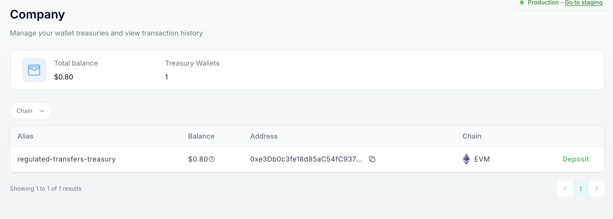
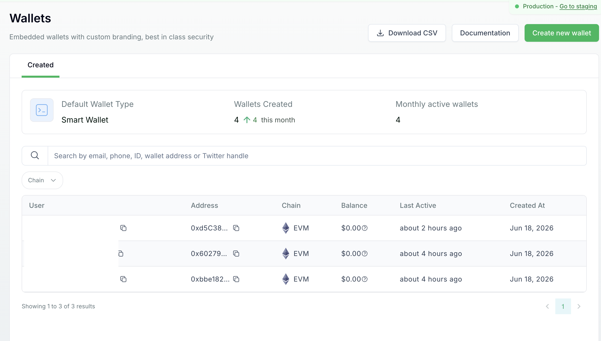
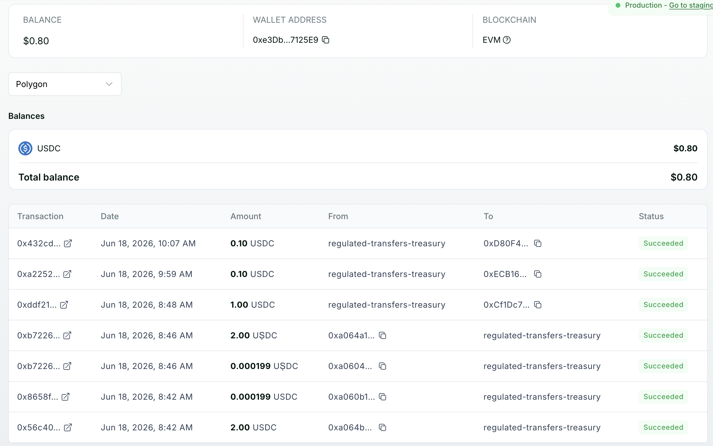

<div align="center">

<br><br>
<h1>Crossmint Payouts - staging quickstart</h1>
<div align="center">
<a href="https://www.crossmint.com/quickstarts">All Quickstarts</a> | <a href="https://docs.crossmint.com/stablecoin-orchestration/regulated-transfers/overview">Payouts Docs</a>
</div>
<br><br>
</div>

A small, self-documenting Deno CLI that runs a Crossmint **regulated stablecoin payout** end to end:
a company treasury wallet pays out to a KYC-verified recipient, on Crossmint's licensed
infrastructure. It uses the
[Crossmint wallets SDK](https://docs.crossmint.com/wallets/quickstarts/nodejs) with a server signer.

The CLI prints a plan, narrates each step, and on any block prints the exact reason plus the
relevant docs link - so the output alone explains what a project needs to support the flow. It is
staging-first and safe to re-run as a test suite.

> AML, KYC, sanctions screening, and Travel Rule are handled by Crossmint. You provide the
> recipient's details; Crossmint runs the checks at transfer time. See the
> [Regulated Transfers overview](https://docs.crossmint.com/stablecoin-orchestration/regulated-transfers/overview).

## What it does

```
treasury (COMPANY) wallet  --payout-->  recipient (KYC-verified user)
```

1. **Treasury wallet** - `owner: "COMPANY"`, server signer, fixed `alias`. Idempotent on the alias,
   so it is the same address every run (locator `COMPANY:<alias>`).
   [Treasury wallets guide](https://docs.crossmint.com/wallets/guides/treasury-wallets)
2. **Recipient user** - registered via the REST users API (provide their `userDetails`: name, date
   of birth, country of residence).
   [Users REST API](https://docs.crossmint.com/wallets/quickstarts/restapi)
3. **Recipient wallet** - a wallet owned by that user.
   [Create a wallet](https://docs.crossmint.com/wallets/guides/create-wallet)
4. **Payout** - treasury to the recipient, `transactionType: "regulated-transfer"`. The transfer
   triggers the recipient's KYC + sanctions screen automatically.
   [Making a payout](https://docs.crossmint.com/stablecoin-orchestration/regulated-transfers/guides/transfers)

Wallets and the payout use the SDK; the recipient setup (step 2) uses REST, because the SDK does not
cover it.

## In the Console

After a run, the treasury, the recipient wallets, and the payout history all show up in the
[Crossmint Console](https://www.crossmint.com/console).

**Treasury wallet (Company)**



**Recipient wallets (Users)**



**Payout history**



## How signing works: server signer

You generate a secret (`xmsk1_<64 hex>`); the SDK derives the wallet address deterministically from
it and signs locally - only the address is sent to Crossmint. Same secret, same wallet. No private
keys to manage and no manual signature handling. For production treasury reserves you can instead
point the admin signer at your own Cloud KMS key; the flow is identical.

[Server signer](https://docs.crossmint.com/wallets/guides/signers/server-signer) ·
[Custody models](https://docs.crossmint.com/wallets/concepts/custody-models)

## Prerequisites

- [Deno](https://deno.com) installed.
- A Crossmint project and a server-side API key. Staging is self-serve - create them in the
  [Console](https://staging.crossmint.com/console). Production payouts are enabled by Crossmint;
  reach out to your Crossmint contact to turn them on for your project.
  [API keys overview](https://docs.crossmint.com/introduction/platform/api-keys/overview) ·
  [Server-side keys](https://docs.crossmint.com/introduction/platform/api-keys/server-side) ·
  [Scopes](https://docs.crossmint.com/introduction/platform/api-keys/scopes)

Start on staging; everything here runs against `staging.crossmint.com`. For production, flip `ENV`,
use a production key, and set a production chain.
[Staging vs production](https://docs.crossmint.com/introduction/platform/staging-vs-production)

## Quickstart

```bash
git clone <this-repo> && cd <this-repo>
cp .env.example .env

deno task gen-secret        # prints xmsk1_... -> paste into .env as CROSSMINT_SIGNER_SECRET
# set CROSSMINT_API_KEY in .env (a staging server key)

deno task transfer:dry      # set up wallets + recipient, PREPARE the payout (no funds move)
deno task transfer          # execute the payout
deno task inspect           # balances + recent transfers, via the SDK
```

Fund the treasury once: on staging, mint Crossmint's staging token with `deno task`
(`await treasury.stagingFund(...)`) or send testnet USDC from the
[Circle faucet](https://faucet.circle.com) to the treasury address.
[Get staging tokens](https://docs.crossmint.com/wallets/guides/get-staging-tokens)

The setup steps are idempotent, so it is safe to re-run. The treasury is reused via its alias - fund
that one address once, then re-run freely. Each non-dry run sends one fresh payout.

## Tasks

| Task                     | What it does                                                      |
| ------------------------ | ----------------------------------------------------------------- |
| `deno task gen-secret`   | Print a new server-signer secret                                  |
| `deno task transfer`     | Run the payout (executes)                                         |
| `deno task transfer:dry` | Same setup, but prepare the payout without executing              |
| `deno task inspect`      | Print treasury + recipient balances and recent transfers          |
| `deno task docs`         | Run the flow live and write a local `docs/REGULATED_TRANSFERS.md` |
| `deno task check`        | `deno fmt --check` + `deno check`                                 |
| `deno task fmt`          | Format                                                            |

Flags: `--dry-run` (prepare only), `--debug` (show the SDK's own logs).

## Supported countries

`RECIPIENT_COUNTRY` must be a **supported** country of residence. An unsupported country is rejected
at payout time.

A freshly created recipient is screened first; while the screen runs the payout returns
`"User KYC is in progress, retry in a few seconds"`. The CLI retries until it clears - seconds for a
clean, supported-country recipient.

## Self-documenting

`deno task docs` runs the flow live and writes `docs/REGULATED_TRANSFERS.md` from the real requests,
responses, addresses, and outcomes of that run. It wraps `fetch` before the SDK initializes, so the
doc shows the actual Crossmint API calls underneath the SDK, with full untruncated ids. The doc is a
byproduct of execution, so it cannot drift from the API. The API key is never recorded and any
signer secret is redacted.

The generated doc is gitignored: it captures the addresses and tx hashes from your own run, so it
stays a local reference rather than a committed file. See [`docs/TESTING.md`](docs/TESTING.md) for
the full test matrix.

## Configuration (env)

| Var                                        | Default            | Notes                                                              |
| ------------------------------------------ | ------------------ | ------------------------------------------------------------------ |
| `ENV`                                      | `staging`          | `staging` or `production`                                          |
| `CROSSMINT_API_KEY`                        | (required)         | server key; staging self-serve, production enabled by Crossmint    |
| `CROSSMINT_SIGNER_SECRET`                  | (required)         | server-signer secret (`deno task gen-secret`)                      |
| `CHAIN`                                    | `polygon-amoy`     | EVM chain that supports regulated transfers; use `polygon` in prod |
| `TOKEN`                                    | `usdc`             | currency symbol passed to the SDK (no chain prefix)                |
| `TREASURY_ALIAS`                           | `payouts-treasury` | stable alias, same treasury every run                              |
| `RECIPIENT_EMAIL` (+ name / DOB / country) | (sample)           | KYC'd recipient user                                               |
| `AMOUNT`                                   | `0.1`              | decimal string                                                     |

## Permissions

Tasks run with an explicit Deno permission set - no `-A`, no prompts:

```
--allow-env    read configuration from the environment / .env
--allow-read   read .env and node_modules
--allow-net    talk to the Crossmint API
--allow-ffi    load the native module the SDK pulls in
```

## Docs / Learn more

**Payouts (regulated transfers)**

- [Overview](https://docs.crossmint.com/stablecoin-orchestration/regulated-transfers/overview)
- [Quickstart](https://docs.crossmint.com/stablecoin-orchestration/regulated-transfers/quickstart)
- [Making a payout](https://docs.crossmint.com/stablecoin-orchestration/regulated-transfers/guides/transfers)

**Wallets**

- [Wallets overview](https://docs.crossmint.com/wallets/overview)
- [Treasury wallets](https://docs.crossmint.com/wallets/guides/treasury-wallets)
- [Wallets SDK (Node.js)](https://docs.crossmint.com/wallets/quickstarts/nodejs)
- [Users REST API](https://docs.crossmint.com/wallets/quickstarts/restapi)
- [Check balances](https://docs.crossmint.com/wallets/guides/check-balances)
- [Transfer tokens](https://docs.crossmint.com/wallets/guides/transfer-tokens)
- [List transfers](https://docs.crossmint.com/wallets/guides/list-transfers)
- [Monitor transfers (webhooks)](https://docs.crossmint.com/wallets/guides/monitor-transfers-webhooks)

**Signers & custody**

- [Server signer](https://docs.crossmint.com/wallets/guides/signers/server-signer)
- [Custody models](https://docs.crossmint.com/wallets/concepts/custody-models)

**Platform**

- [API keys overview](https://docs.crossmint.com/introduction/platform/api-keys/overview)
- [Server-side keys](https://docs.crossmint.com/introduction/platform/api-keys/server-side)
- [Scopes](https://docs.crossmint.com/introduction/platform/api-keys/scopes)
- [Staging vs production](https://docs.crossmint.com/introduction/platform/staging-vs-production)
- [Get staging tokens](https://docs.crossmint.com/wallets/guides/get-staging-tokens)

## License

MIT - see [LICENSE](LICENSE).
